## 实验配置环境
本次实验配置的操作环境
* Ubuntu version 17.10.1 x64
* Linux version 3.18.6
* Linux version 4.1.51
* gdb version 7.11.1
* VMWare Fusion version 10.0.1
* QEMU version 2.12.0

## linux内核源码的获取及分支管理
在kernel的官网上有三种版本，mainline，stable，longterm
* mainline是主线版本，最新的
* stable是稳定版
* longterm是长期支持版

 kernel的官方网站(https://www.kernel.org/)获得，在这里采取了直接在kernel官网下载然后拖入vmware虚拟机中进行解压的方法。
 解压完成后输入一下代码
 

```c
xz -d linux-3.18.6.tar.xz
tar -xvf linux-3.18.6.tar
cd linux-3.18.6
make clean
make x86_64_defconfig
#此时发现这边有一个小问题，就是没有打开compile the kernel with debug info 选项
#所以重新再make menuconfig下进行设置
#先输入sudo apt-get install libncurses5-dev libncursesw5-dev

make menuconfig
#再在kernel hacking 下勾上compile the kernel with debug info 
#此时再次使用make进行重新编译
make -j 4 #将vmware可使用的cpu

```

*注意上一步中其实make内核的时候容易产生较大的问题*
因为gcc版本所以会出现bug
此时就需要将gcc版本默认降级就可以成功make了
具体降级的办法如下

```c
sudo apt-get install gcc-4.8
sudo update-alternatives --install /usr/bin/gcc gcc /usr/bin/gcc-4.8 100
sudo update-alternatives --config gcc
```

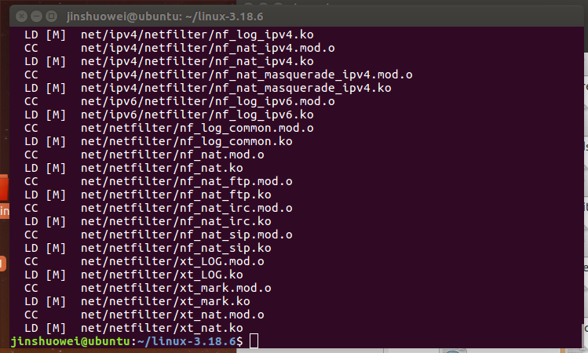
如图是编译好内核后的结果

### 接下来开始制作根文件系统

```c
cd ..
mkdir rootfs
git clone https://github.com/mengning/menu.git
cd menu
gcc -o init linktable.c menu.c test.c -m32 -static -lpthread #全部使用静态的方式
cd ../rootfs
cp ../menu/init ./
find . | cpio -o -Hnewc |gzip -9 > ../rootfs.img #把rootfs打包好

```

*注意在这里第四步的时候，需要在前面执行一句*
sudo apt-get install g++-7-multilib
7:用版本号代替
否则无法运行

### 启动MenuOS系统

```c
cd ..
qemu-system-x86_64 -kernel arch/x86_64/boot/bzImage -initrd rootfs.img -S -s


```

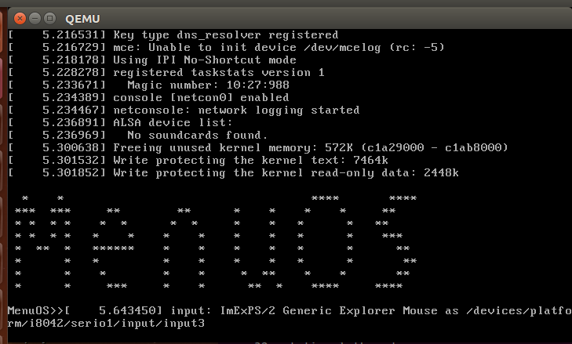
如图是成功启动menuos的界面

## 使用gdb跟踪调试内核

```c
cd ..
qemu-system-x86_64 -kernel linux-3.18.6/arch/x86/boot/bzImage -initrd rootfs.img -s -S
```

-S是在程序开始的时候用来冻结CPU的
-s 是使用gdb tcp::1234端口的shorthand
此时输入完命令，发现窗口确实处于被冻结状态
此时使用VNC来连接
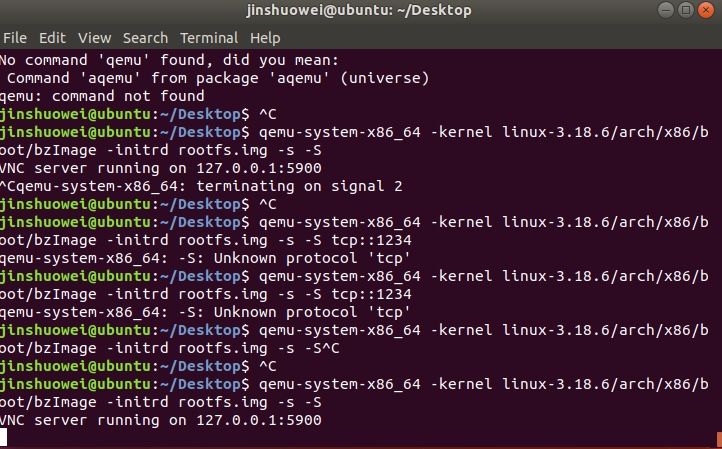
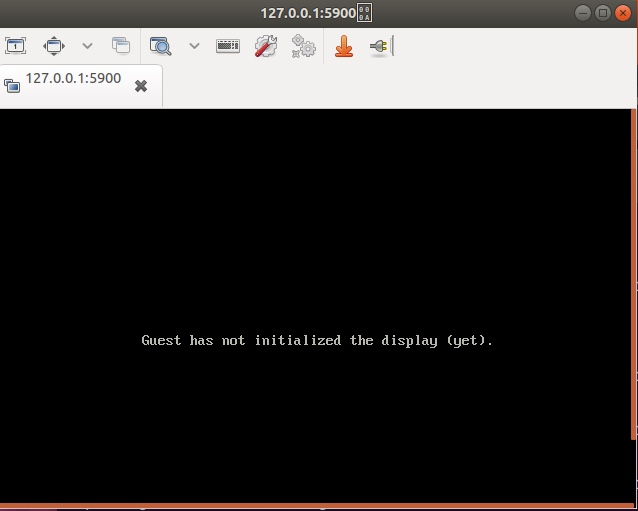

此时再新开一个terminal窗口，用其打开gdb

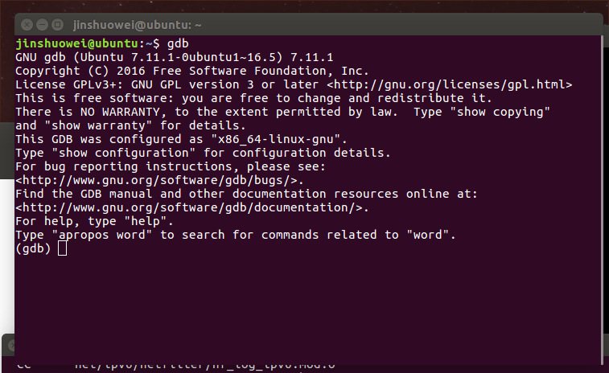

### 在gdb窗口输入以下命令

```c
file linux-3.18.6/vmlinux
target remote:1234
break start_kernel #这样就在内核启动的位置设置了一个断点
c #使得系统开始执行qemu
#用类似的方法可以设置更多的断点
break rest_init
```

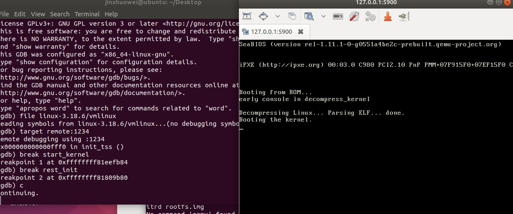

*在这里发现了qemu程序的一个问题，该程序无法自动启动*
所以在这里想要更新一下qemu
于是先到qemu.org上下载了最新版本的qemu
然后直接放在了ubuntu下面进行了解压
然后cd到当那个文件夹下
并输入一下指令

```c
./configure
make
make install
```

*在./configure时发现少了一些包，又装了一下这些包*
接下来清除编译过程中产生的临时文件和过程中产生的文件

```c
make clean
make distclean
```

此时需要用VNC连接远程桌面来访问qemu

此时需要

## 跟踪内核的启动过程
知道了如何跟踪内核后，需要有目的地跟踪
*这时候发现由于linux内核问题，在换到ubuntu17.10.1的时候booting的时候无法启动，这里开始测试内核linux 4.1.51*
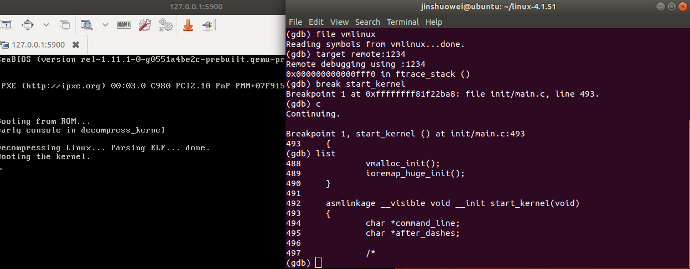
### start_kernel
现在来研究一下start_kernel函数的源代码

```c
asmlinkage __visible void __init start_kernel(void)
{
	char *command_line;
	char *after_dashes;

	/*
	 * Need to run as early as possible, to initialize the
	 * lockdep hash:
	 */
	lockdep_init();
	set_task_stack_end_magic(&init_task);
	smp_setup_processor_id();
	debug_objects_early_init();

	/*
	 * Set up the the initial canary ASAP:
	 */
	boot_init_stack_canary();

	cgroup_init_early();

	local_irq_disable();
	early_boot_irqs_disabled = true;

/*
 * Interrupts are still disabled. Do necessary setups, then
 * enable them
 */
	boot_cpu_init();
	page_address_init();
	pr_notice("%s", linux_banner);
	setup_arch(&command_line);
	mm_init_cpumask(&init_mm);
	setup_command_line(command_line);
	setup_nr_cpu_ids();
	setup_per_cpu_areas();
	smp_prepare_boot_cpu();	/* arch-specific boot-cpu hooks */

	build_all_zonelists(NULL, NULL);
	page_alloc_init();

	pr_notice("Kernel command line: %s\n", boot_command_line);
	parse_early_param();
	after_dashes = parse_args("Booting kernel",
				  static_command_line, __start___param,
				  __stop___param - __start___param,
				  -1, -1, &unknown_bootoption);
	if (!IS_ERR_OR_NULL(after_dashes))
		parse_args("Setting init args", after_dashes, NULL, 0, -1, -1,
			   set_init_arg);

	jump_label_init();

	/*
	 * These use large bootmem allocations and must precede
	 * kmem_cache_init()
	 */
	setup_log_buf(0);
	pidhash_init();
	vfs_caches_init_early();
	sort_main_extable();
	trap_init();
	mm_init();

	/*
	 * Set up the scheduler prior starting any interrupts (such as the
	 * timer interrupt). Full topology setup happens at smp_init()
	 * time - but meanwhile we still have a functioning scheduler.
	 */
	sched_init();
	/*
	 * Disable preemption - early bootup scheduling is extremely
	 * fragile until we cpu_idle() for the first time.
	 */
	preempt_disable();
	if (WARN(!irqs_disabled(),
		 "Interrupts were enabled *very* early, fixing it\n"))
		local_irq_disable();
	idr_init_cache();
	rcu_init();

	/* trace_printk() and trace points may be used after this */
	trace_init();

	context_tracking_init();
	radix_tree_init();
	/* init some links before init_ISA_irqs() */
	early_irq_init();
	init_IRQ();
	tick_init();
	rcu_init_nohz();
	init_timers();
	hrtimers_init();
	softirq_init();
	timekeeping_init();
	time_init();
	sched_clock_postinit();
	perf_event_init();
	profile_init();
	call_function_init();
	WARN(!irqs_disabled(), "Interrupts were enabled early\n");
	early_boot_irqs_disabled = false;
	local_irq_enable();

	kmem_cache_init_late();

	/*
	 * HACK ALERT! This is early. We're enabling the console before
	 * we've done PCI setups etc, and console_init() must be aware of
	 * this. But we do want output early, in case something goes wrong.
	 */
	console_init();
	if (panic_later)
		panic("Too many boot %s vars at `%s'", panic_later,
		      panic_param);

	lockdep_info();

	/*
	 * Need to run this when irqs are enabled, because it wants
	 * to self-test [hard/soft]-irqs on/off lock inversion bugs
	 * too:
	 */
	locking_selftest();

#ifdef CONFIG_BLK_DEV_INITRD
	if (initrd_start && !initrd_below_start_ok &&
	    page_to_pfn(virt_to_page((void *)initrd_start)) < min_low_pfn) {
		pr_crit("initrd overwritten (0x%08lx < 0x%08lx) - disabling it.\n",
		    page_to_pfn(virt_to_page((void *)initrd_start)),
		    min_low_pfn);
		initrd_start = 0;
	}
#endif
	page_ext_init();
	debug_objects_mem_init();
	kmemleak_init();
	setup_per_cpu_pageset();
	numa_policy_init();
	if (late_time_init)
		late_time_init();
	sched_clock_init();
	calibrate_delay();
	pidmap_init();
	anon_vma_init();
	acpi_early_init();
#ifdef CONFIG_X86
	if (efi_enabled(EFI_RUNTIME_SERVICES))
		efi_enter_virtual_mode();
#endif
#ifdef CONFIG_X86_ESPFIX64
	/* Should be run before the first non-init thread is created */
	init_espfix_bsp();
#endif
	thread_info_cache_init();
	cred_init();
	fork_init();
	proc_caches_init();
	buffer_init();
	key_init();
	security_init();
	dbg_late_init();
	vfs_caches_init(totalram_pages);
	signals_init();
	/* rootfs populating might need page-writeback */
	page_writeback_init();
	proc_root_init();
	nsfs_init();
	cpuset_init();
	cgroup_init();
	taskstats_init_early();
	delayacct_init();

	check_bugs();

	acpi_subsystem_init();
	sfi_init_late();

	if (efi_enabled(EFI_RUNTIME_SERVICES)) {
		efi_late_init();
		efi_free_boot_services();
	}

	ftrace_init();

	/* Do the rest non-__init'ed, we're now alive */
	rest_init();
}

/* Call all constructor functions linked into the kernel. */
static void __init do_ctors(void)
{
#ifdef CONFIG_CONSTRUCTORS
	ctor_fn_t *fn = (ctor_fn_t *) __ctors_start;

	for (; fn < (ctor_fn_t *) __ctors_end; fn++)
		(*fn)();
#endif
}

bool initcall_debug;
core_param(initcall_debug, initcall_debug, bool, 0644);

#ifdef CONFIG_KALLSYMS
struct blacklist_entry {
	struct list_head next;
	char *buf;
};


```

无论研究什么内核模块，都应该先来研究start_kernel，因为所有内核重要的模块都会在这里初始化
* 初始化lock validator（lockdep_init)
* 初始化高端内存的映射表 (page_address_init())
* 设置操作系统的第一个进程init (set_task_stack_end_magic)
* 设置obj_hash, obj_static_pool两个全局变量

* 内核架构相关初始化函数，包含处理器相关参数的初始化、内核启动参数的获取和前期处理、内存子系统的早期初始化 (setup_arch)
* 初始化文件系统的缓冲区，并计算最大可以使用的文件缓存（buffer_init()）
* 对内核陷阱异常进行初始化，初始化一些中断向量，在ARM系统里是空函数，没有任何的初始化（trap_init()）
* 初始化软件中断（softirq_init()）
* 设置内存页分配通知器 (page_alloc_init)
* 中断描述符号表初始化 (trap_init)
* 初始化内存管理器 (mm_init)
* 对进程调度器的数据结构进行初始化 (sched_init)
* 初始化直接读拷贝更新的锁机制 (rcu_init)
* 初始化内核信号队列（ signals_init()）
* 初始化系统时钟，开启一个硬件定时器 (time_init)
* 启用中断操作 (local_irq_enable)
* 检查CPU配置、FPU等是否非法使用不具备的功能，检查CPU BUG，软件规避BUG  ( check_bugs())
* 控制台初始化 (console_init)
* 完成剩余部分 (rest_init) 

现在我们先将断点设置到set_task_stack_end_magic()函数处
因为在start_kernel()中，我们看到调用的第一个函数式lockdep_init(),该函数会初始化内核死锁检测机制的hash table,接下来就是set_task_stack_end_magic()函数。所以先看一下set_task_stack_end_magic()函数

### set_task_stack_end_magic()
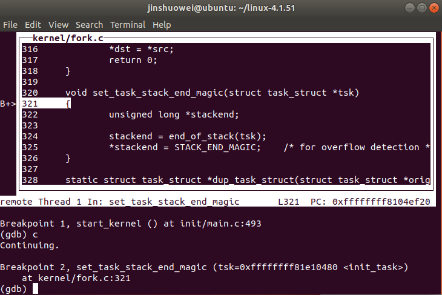

###setup_arch
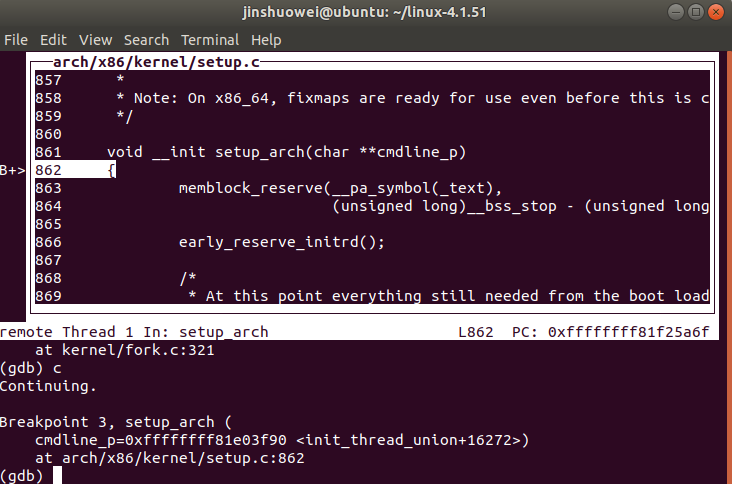
下面找出代码进行分析

```c
void __init setup_arch(char **cmdline_p)  
{  
    struct tag *tags = (struct tag *)&init_tags; //定义了一个默认的内核参数列表  
    struct machine_desc *mdesc;     //设备描述的结构体  
    char *from = default_command_line;  
    init_tags.mem.start = PHYS_OFFSET;  
    unwind_init();  
    setup_processor();                  //汇编的CPU初始化部分  
    mdesc = setup_machine(machine_arch_type);  
    machine_desc = mdesc;  
    machine_name = mdesc->name;  
    //下面一部分通过匹配struct machine_desc结构体数据，初始化一些全局变量  
    //通过struct machine_desc 中的soft_reboot设置重启类型  
    if (mdesc->soft_reboot)   
        reboot_setup("s");  
  
    //检查bootloader是否传入参数，如果传入，则给tags赋值，若果没有传入则传递默认的启动参数地址  
    if (__atags_pointer)      
        tags = phys_to_virt(__atags_pointer);  
    else if (mdesc->boot_params) {  
#ifdef CONFIG_MMU  
        /* 
         * We still are executing with a minimal MMU mapping created 
         * with the presumption that the machine default for this 
         * is located in the first MB of RAM.  Anything else will 
         * fault and silently hang the kernel at this point. 
         */  
        if (mdesc->boot_params < PHYS_OFFSET ||  
            mdesc->boot_params >= PHYS_OFFSET + SZ_1M) {  
            printk(KERN_WARNING  
                   "Default boot params at physical 0x%08lx out of reach\n",  
                   mdesc->boot_params);  
        } else  
#endif  
        {  
            tags = phys_to_virt(mdesc->boot_params);  
        }  
    }  
 
#if defined(CONFIG_DEPRECATED_PARAM_STRUCT)  
    /* 
     * If we have the old style parameters, convert them to 
     * a tag list. 
     */  
    if (tags->hdr.tag != ATAG_CORE)  //内核参数列表第一项为ATAG_CORE  
        convert_to_tag_list(tags);  
    //如果不是，这需要转换成新的内核参数类型，新的内核参数类型用下面的structtag结构表示  
#endif  
    if (tags->hdr.tag != ATAG_CORE)  
        tags = (struct tag *)&init_tags;  
    //如果没有内核参数，则选用默认的内核参数，在init_tags文件中有定义  
  
    if (mdesc->fixup)  
        mdesc->fixup(mdesc, tags, &from, &meminfo);  
    //用选用的内核参数列表填充meminfo ，fixup函数出现在注册machine_desc中，即MACHINE_START、MACHINE_END定义中，这个函数，有些板子有，但在2410中没有定义这个函数。  
  
    if (tags->hdr.tag == ATAG_CORE) {  
        if (meminfo.nr_banks != 0)  //如果内存被初始化过  
            squash_mem_tags(tags);    
        //如果是tag list,那么如果系统已经创建了默认的meminfo.nr_banks，清除tags中关于MEM的参数，以免再次被初始化     
  
        save_atags(tags);  
        parse_tags(tags);   //做一些针对各个tags的处理  
    }  
    //解析内核参数列表，然后调用内核参数列表的处理函数对这些参数进行处理。比如，如果列表为命令行，则最终会用parse_tag_cmdlin函数进行解析，这个函数用_tagtable编译连接到了内核里  
  
    init_mm.start_code = (unsigned long) _text;  
    init_mm.end_code   = (unsigned long) _etext;  
    init_mm.end_data   = (unsigned long) _edata;  
    init_mm.brk    = (unsigned long) _end;  
    //记录了内核代码的起始，结束虚拟地址  
  
    /* parse_early_param needs a boot_command_line */  
    strlcpy(boot_command_line, from, COMMAND_LINE_SIZE);  
  
    /* populate cmd_line too for later use, preserving boot_command_line */  
    strlcpy(cmd_line, boot_command_line, COMMAND_LINE_SIZE);  
    *cmdline_p = cmd_line;  
    //将boot_command_line复制到cmd_line中  
  
    parse_early_param();                //解释命令行参数  
  
    arm_memblock_init(&meminfo, mdesc); //将设备实体登记注册到总线空间链表中去  
  
    paging_init(mdesc);  
    request_standard_resources(mdesc);    
 
#ifdef CONFIG_SMP  
    if (is_smp())  
        smp_init_cpus();    //要配置CONFIG_KEXEC，否则为空函数,2410中没有配置  
#endif  
    reserve_crashkernel();   
  
    cpu_init(); //初始化一个CPU，并设置一个per-CPU栈  
    tcm_init(); //初始化ARM内部的TCM（紧耦合内存）  
 
#ifdef CONFIG_MULTI_IRQ_HANDLER  
    handle_arch_irq = mdesc->handle_irq;  
#endif  
 
#ifdef CONFIG_VT  
#if defined(CONFIG_VGA_CONSOLE)  
    conswitchp = &vga_con;  
#elif defined(CONFIG_DUMMY_CONSOLE)  
    conswitchp = &dummy_con;  
#endif  
#endif  
    early_trap_init();      //对中断向量表进行早期的初始化  
    //如果设备描述结构体定义了init_early函数（应该是早期初始化之意），则在这里调用   
    if (mdesc->init_early)             
        mdesc->init_early();  
}  
```

### trap_init
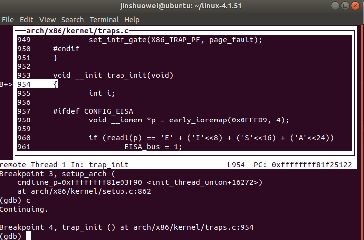

```c
void __init trap_init(void)
{
	int i;

#ifdef CONFIG_EISA
	void __iomem *p = early_ioremap(0x0FFFD9, 4);

	if (readl(p) == 'E' + ('I'<<8) + ('S'<<16) + ('A'<<24))
		EISA_bus = 1;
	early_iounmap(p, 4);
#endif

	set_intr_gate(X86_TRAP_DE, divide_error);
	set_intr_gate_ist(X86_TRAP_NMI, &nmi, NMI_STACK);
	/* int4 can be called from all */
	set_system_intr_gate(X86_TRAP_OF, &overflow);
	set_intr_gate(X86_TRAP_BR, bounds);
	set_intr_gate(X86_TRAP_UD, invalid_op);
	set_intr_gate(X86_TRAP_NM, device_not_available);
#ifdef CONFIG_X86_32
	set_task_gate(X86_TRAP_DF, GDT_ENTRY_DOUBLEFAULT_TSS);
#else
	set_intr_gate_ist(X86_TRAP_DF, &double_fault, DOUBLEFAULT_STACK);
#endif
	set_intr_gate(X86_TRAP_OLD_MF, coprocessor_segment_overrun);
	set_intr_gate(X86_TRAP_TS, invalid_TSS);
	set_intr_gate(X86_TRAP_NP, segment_not_present);
	set_intr_gate(X86_TRAP_SS, stack_segment);
	set_intr_gate(X86_TRAP_GP, general_protection);
	set_intr_gate(X86_TRAP_SPURIOUS, spurious_interrupt_bug);
	set_intr_gate(X86_TRAP_MF, coprocessor_error);
	set_intr_gate(X86_TRAP_AC, alignment_check);
#ifdef CONFIG_X86_MCE
	set_intr_gate_ist(X86_TRAP_MC, &machine_check, MCE_STACK);
#endif
	set_intr_gate(X86_TRAP_XF, simd_coprocessor_error);

	/* Reserve all the builtin and the syscall vector: */
	for (i = 0; i < FIRST_EXTERNAL_VECTOR; i++)
		set_bit(i, used_vectors);

#ifdef CONFIG_IA32_EMULATION
	set_system_intr_gate(IA32_SYSCALL_VECTOR, ia32_syscall);
	set_bit(IA32_SYSCALL_VECTOR, used_vectors);
#endif

#ifdef CONFIG_X86_32
	set_system_trap_gate(SYSCALL_VECTOR, &system_call);
	set_bit(SYSCALL_VECTOR, used_vectors);
#endif

	/*
	 * Set the IDT descriptor to a fixed read-only location, so that the
	 * "sidt" instruction will not leak the location of the kernel, and
	 * to defend the IDT against arbitrary memory write vulnerabilities.
	 * It will be reloaded in cpu_init() */
	__set_fixmap(FIX_RO_IDT, __pa_symbol(idt_table), PAGE_KERNEL_RO);
	idt_descr.address = fix_to_virt(FIX_RO_IDT);

	/*
	 * Should be a barrier for any external CPU state:
	 */
	cpu_init();

	/*
	 * X86_TRAP_DB and X86_TRAP_BP have been set
	 * in early_trap_init(). However, ITS works only after
	 * cpu_init() loads TSS. See comments in early_trap_init().
	 */
	set_intr_gate_ist(X86_TRAP_DB, &debug, DEBUG_STACK);
	/* int3 can be called from all */
	set_system_intr_gate_ist(X86_TRAP_BP, &int3, DEBUG_STACK);

	x86_init.irqs.trap_init();

#ifdef CONFIG_X86_64
	memcpy(&debug_idt_table, &idt_table, IDT_ENTRIES * 16);
	set_nmi_gate(X86_TRAP_DB, &debug);
	set_nmi_gate(X86_TRAP_BP, &int3);
#endif
}

```

### rest_init()
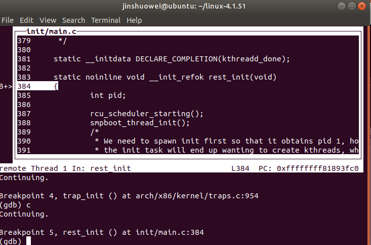
rest_init()函数分析
  (1)rest_init中调用kernel_thread函数启动了2个内核线程，分别是：kernel_init和kthreadd
  (2)调用schedule函数开启了内核的调度系统，从此linux系统开始转起来了。
  (3)rest_init最终调用cpu_idle函数结束了整个内核的启动。也就是说linux内核最终结束了一个函数cpu_idle。这个函数里面肯定是死循环。
  (4)简单来说，linux内核最终的状态是：有事干的时候去执行有意义的工作（执行各个进程任务），实在没活干的时候就去死循环（实际上死循环也可以看成是一个任务）。
  (5)之前已经启动了内核调度系统，调度系统会负责考评系统中所有的进程，这些进程里面只有有哪个需要被运行，调度系统就会终止cpu_idle死循环进程（空闲进程）转而去执行有意义的干活的进程。这样操作系统就转起来了。

### kernel_init()
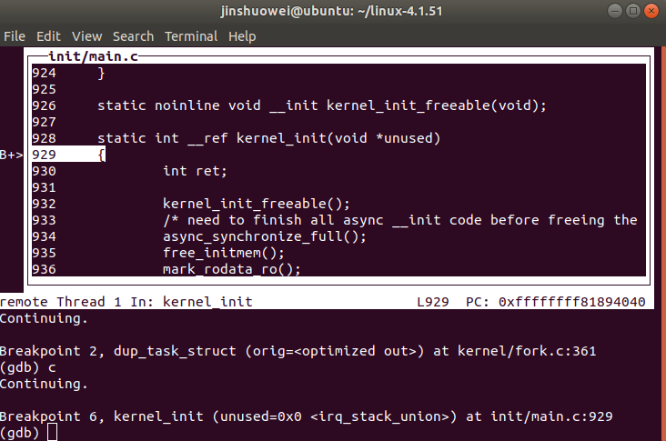
1. 打开控制台设备

```c
    if (sys_open((const char __user *) "/dev/console", O_RDWR, 0) < 0)
        printk(KERN_WARNING "Warning: unable to open an initial console.\n");

    (void) sys_dup(0);
    (void) sys_dup(0);
```

2. 挂载根文件系统

```c
    if (sys_access((const char __user *) ramdisk_execute_command, 0) != 0) {
        ramdisk_execute_command = NULL;
        prepare_namespace();
    }
```

* prepare_namespace这个函数负责挂载根文件系统
* 如果内核挂载根文件系统成功，则会打印出：VFS: Mounted root (xxxx filesystem) on device xxxx. 
如果挂载根文件系统失败，则会打印：No filesystem could mount root, tried: xxxx

3. 启动init进程

```c
if (ramdisk_execute_command) {
        run_init_process(ramdisk_execute_command);
        printk(KERN_WARNING "Failed to execute %s\n",
                ramdisk_execute_command);
    }

    /*
     * We try each of these until one succeeds.
     *
     * The Bourne shell can be used instead of init if we are
     * trying to recover a really broken machine.
     */
    if (execute_command) {
        run_init_process(execute_command);
        printk(KERN_WARNING "Failed to execute %s.  Attempting "
                    "defaults...\n", execute_command);
    }
    run_init_process("/sbin/init");
    run_init_process("/etc/init");
    run_init_process("/bin/init");
    run_init_process("/bin/sh");

    panic("No init found.  Try passing init= option to kernel. "
          "See Linux Documentation/init.txt for guidance.");
```

## 启动完成
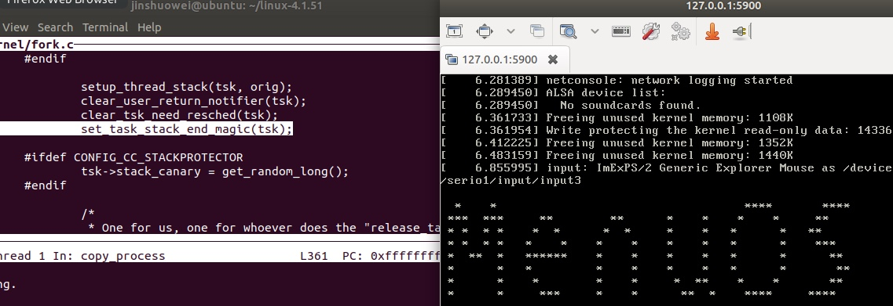

## 实验总结
本次实验麻烦之处其实在于环境的配置，对于linux启动事件的跟踪只要像助教所说那样对于linux源代码进行比较一些研究之后不难分析。
但是在配置环境的时候却遇到了很多麻烦，一开始在ubuntu 16.04下面配置，并选的linux版本号是3.18后来发现qemu会在这种情况下卡死，这个问题不好解决。后来于是换到ubuntu17.10下进行实验，此时却发现gcc版本过高，编译较老的内核的时候又会出错，于是将gcc降级到4.8。后来发现因为内核的原因，在测试的时候qemu会卡在booting界面无法启动，于是将内核版本号升级到4.15最终终于成功。


